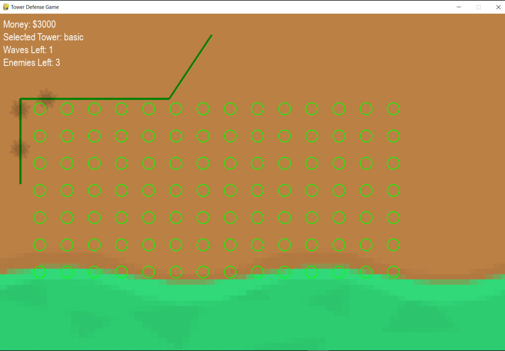
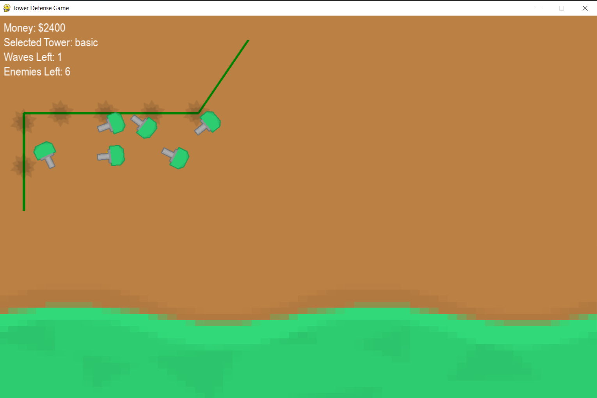
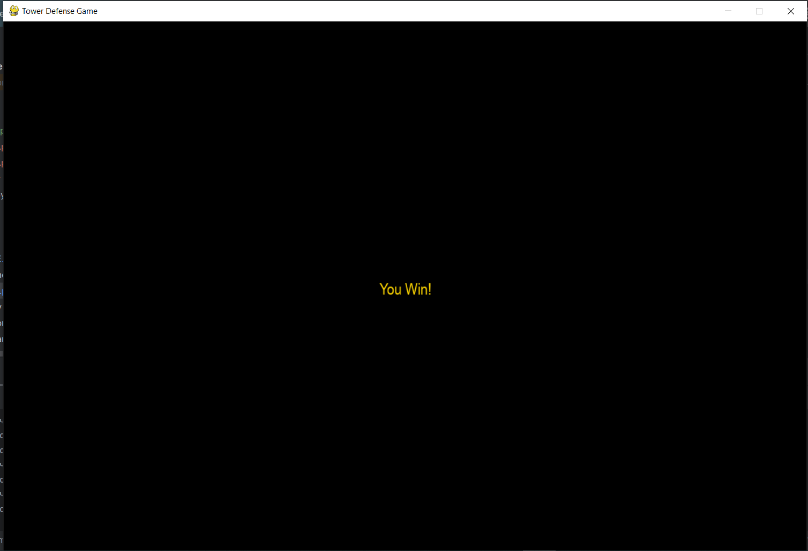
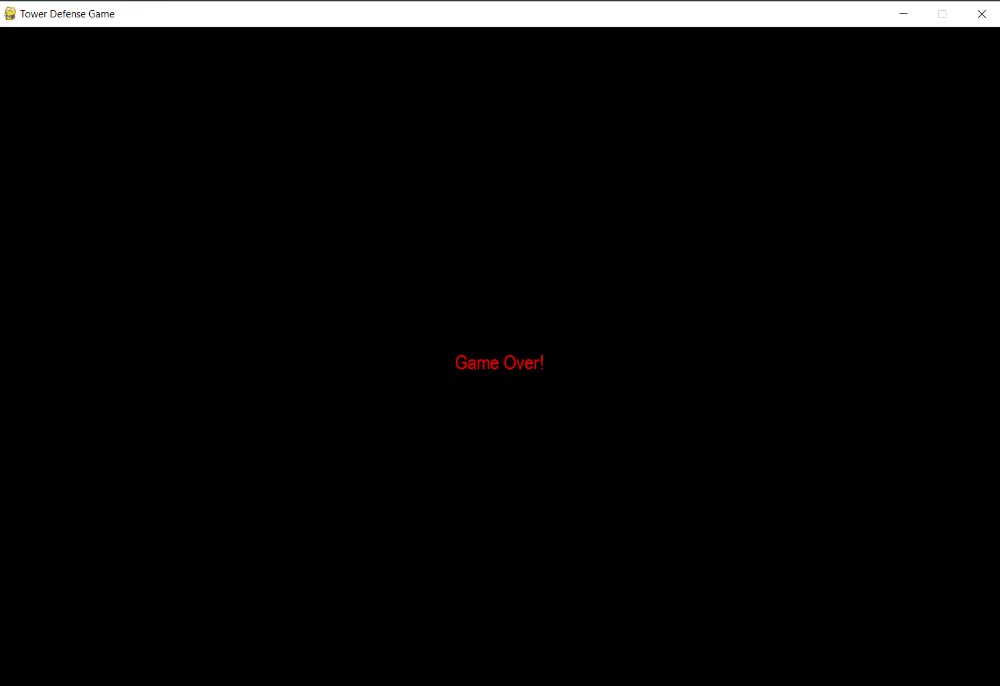
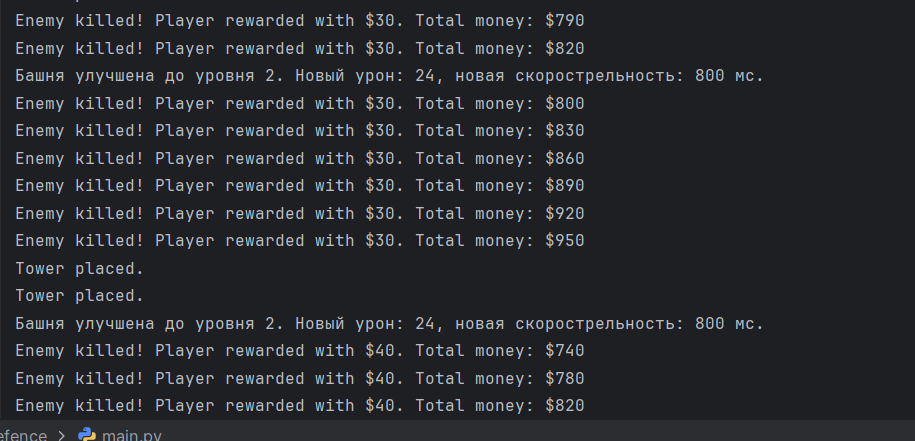

# Проект "Tower Defense Game" является реализацией игры в жанре "Tower Defense", где игроку предстоит защищать базу от волн врагов, расставляя башни.  
## Реализован базовый функционал: можно выиграть если пережить три волны, или проиграть если хотя бы один враг дойдёт. Также есть два типа башен, переключение между ними по клавишам 1 и 2.

## Описание проекта:
#### main.py: главный файл, содержащий основной игровой цикл, обработку событий, обновление состояний игры и отрисовку элементов игры.
#### settings.py: файл настроек, содержит параметры конфигурации игры, такие как размеры экрана, стоимость и параметры башен, пути к ресурсам и т.д.
#### level.py: содержит логику уровня, управление волнами врагов, их спавн, а также расстановку башен и обработку коллизий.
#### grid.py: отвечает за управление сеткой, на которой игрок может размещать башни, проверку на доступность места для размещения башни.
#### tower.py: содержит базовый класс башни и его наследники для разных типов башен, содержит логику стрельбы, поиска цели и улучшения.
#### enemy.py: определяет класс врага, его движение по карте, здоровье и получение урона.
#### bullet.py: класс пули, управляет движением пули, проверкой попаданий в врагов и нанесением урона.

## Более подробно об основных модулях, их классах и функциях:
### main.py:
* class TowerDefenseGame: главный класс игры, управляющий основным циклом игры, событиями, обновлениями состояний и отрисовкой;
* __init__(self): конструктор, инициализирует основные параметры игры, загружает ресурсы и создаёт объекты уровня и сетки;
* game_over(self): обрабатывает условия окончания игры;
* is_position_inside(self, pos): проверяет, находится ли позиция в пределах игрового поля;
* _check_events(self): обрабатывает игровые события, такие как нажатие клавиш и клики мыши;
* _update_game(self): обновляет состояние игры, вызывая обновления уровня и сетки;
* _draw_win_screen(self): отображает экран победы;
* _draw_game_over_screen(self): отображает экран проигрыша;
* _draw(self): управляет отрисовкой всех элементов игры;
* run_game(self): запускает основной игровой цикл.

-------------------------------

### level.py:
* class Level: базовый класс для управления уровнями игры, волнами врагов и расстановкой башен;
* class Level1, Level2 и Level3: управляют настройками конкретных уровней; 
* __init__(self, game): инициализирует уровень игры;
* start_next_wave(self): запускает следующую волну врагов;
* spawn_next_enemy(self): генерирует следующего врага текущей волны;
* attempt_place_tower(self, mouse_pos, tower_type): пытается разместить башню выбранного типа в позиции курсора;
* update(self): обновляет состояние уровня, врагов, башен и пуль;
* draw_path(self, screen): отображает пути врагов, этих путей несколько;
* draw(self, screen): отрисовывает уровень, включая врагов, башни и пули.

-------------------------------
### grid.py:
* class Grid: отвечает за сетку, где игрок может размещать башни;
* __init__(self, game): инициализирует сетку;
* update(self): может использоваться для обновления сетки;
* draw(self): отображает сетку на экране;
* place_tower(self, tower): размещает башню на сетке;
* remove_tower(self, tower): удаляет башню с сетки;
* get_grid_position(self, mouse_pos): возвращает позицию сетки, ближайшую к позиции курсора;
* is_spot_available(self, grid_pos): проверяет, доступно ли место для размещения башни.

-------------------------------
### tower.py:
* class Tower: базовый класс для всех башен, его методы включают инициализацию, отрисовку, обновление, стрельбу, поворот к цели и поиск цели;
* class BasicTower ("Базовая башня"): дочерний от класса Tower. Определяет свойства и поведение базовой башни, включая урон, дальность и скорость стрельбы; 
* class SniperTower ("Снайперская башня"): также является наследником от класса Tower. Определяет свойства и поведение базовой башни, включая урон, дальность и скорость стрельбы. 
* class MoneyTower ("Денежная башня"): еще один наследник от класса Tower. Эта башня генерирует деньги для игрока с заданной скоростью.

-------------------------------
### enemy.py:
* class Enemy(pygame.sprite.Sprite): базовый класс для всех врагов. Его методы определяют инициализацию и состояние здоровья, а также действия программы при смерти врага;
* class FastEnemy(Enemy): класс для создания врагов более быстрых, чем в базовом классе, но с низким здоровьем;
* class StrongEnemy(Enemy): класс для создания врагов более медленных, но с высоким здоровьем;
* class BossEnemy(Enemy): класс для создания очень медленных врагов, но с очень высоким здоровьем.

### Скриншоты игры
##### Позиции для расположения башен можно показать:

##### А также можно убрать. Переключение режимов - по кнопке "Пробел":

##### Экран игры при успешном прохождении всех уровней

##### Экран игры при проигрыше игрока

##### Экран консоли во время выполнения программы
